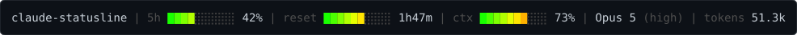
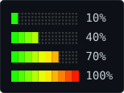

# claude-statusline

(Inspired by AKCodez)

A custom status line for Claude Code. It renders the
current repo, your 5-hour rate-limit usage, the time left in that 5-hour window, and
context-window usage as color-graded bars, plus the active model, reasoning effort, and
a token count.



The bars use a green → yellow → red gradient. Each block is colored by its *position*
in the bar, and only the leading blocks are lit — so a fuller bar isn't just longer,
it's visibly redder:



## Requirements

- `bash`
- [`jq`](https://jqlang.github.io/jq/) — parses the JSON that Claude Code pipes in
- `awk` — gradient math, percentage rounding, and countdown arithmetic
- `date` — current epoch seconds, for the `reset` bar
- A terminal with 24-bit (truecolor) support, for the RGB gradient

## Install

Copy the script somewhere stable and make it executable:

```bash
cp statusline-command.sh ~/.claude/statusline-command.sh
chmod +x ~/.claude/statusline-command.sh
```

Then point Claude Code at it in `~/.claude/settings.json`:

```json
{
  "statusLine": {
    "type": "command",
    "command": "bash $HOME/.claude/statusline-command.sh",
    "refreshInterval": 60
  }
}
```

`settings.statusline.json` in this repo is that snippet, ready to merge into your own
settings file. Claude Code runs the command through a shell, so `$HOME` (or `~`) is
expanded for you — no need to hardcode an absolute path.

`refreshInterval` matters for the `reset` bar: without it the status line only re-renders
on events (a message, a tool call, a model change), so the countdown would sit still
while the session is idle. At `60` it advances about once per minute — the resolution the
countdown is printed at anyway.

## How it works

Claude Code invokes the command on each render and pipes a JSON blob to stdin. The
script reads these fields:

| Field | Used for |
| --- | --- |
| `.workspace.repo.name` | Repo name (falls back to `basename` of `.workspace.current_dir`, then `$PWD`) |
| `.model.display_name` | Model label, e.g. `Opus 5` |
| `.effort.level` | Reasoning effort, shown in parens — omitted when absent |
| `.rate_limits.five_hour.used_percentage` | The `5h` bar |
| `.rate_limits.five_hour.resets_at` | The `reset` bar and its countdown |
| `.context_window.used_percentage` | The `ctx` bar |
| `.context_window.total_input_tokens` + `.total_output_tokens` | The `tokens` count |

Each segment is skipped entirely if its field is missing, so the line degrades
gracefully rather than printing empty bars — with one exception: `tokens` defaults to
`0` instead of dropping out, so it shows `tokens 0` before the session's first API
response. The whole `rate_limits` object is absent for non-subscription accounts and
until the session's first API response, which drops both the `5h` and `reset` segments;
they are read independently, so one can appear without the other. Segments are joined
with a dim gray ` | ` separator, and the whole line is emitted through a single
`printf %b` — the script builds up literal `\033[...m` text and lets that final call
interpret the escapes.

### What the `reset` bar shows

`reset` is a clock, not a gauge. It fills as the rolling 5-hour window elapses, so a
full bar means the reset is imminent, and the label next to it is the time remaining
(`4h58m`, `47m`, `<1m`). Read together with the `5h` bar it tells you your burn rate:
a `5h` bar well ahead of the `reset` bar means you're on pace to run out before the
window turns over.

The payload only gives `resets_at` — the instant the window ends — so elapsed time is
derived as `WINDOW_SECONDS - (resets_at - now)`, with `WINDOW_SECONDS` fixed at `18000`.
Remaining time is clamped to that range, so a stale payload whose `resets_at` has already
passed shows a full bar and `<1m` rather than a negative countdown. Claude Code drops
the window from the payload once `resets_at` passes, and re-renders the status line at
that moment, so the segment disappears until the next API response starts a new window.

### What the token count measures

`tokens` is the sum of `total_input_tokens` and `total_output_tokens`, which the
[status line docs](https://code.claude.com/docs/en/statusline) define as *tokens
currently in the context window, from the most recent API response* — input including
cache reads and writes. It is **not** a cumulative total for the session: it drops
after `/compact`, and it tracks the same underlying number as the `ctx` bar rather than
accumulating alongside it. Claude Code's status line payload exposes no
session-cumulative token field; `cost.total_cost_usd` is the only genuinely cumulative
usage figure available.

Counts are abbreviated by `format_tokens`: `842`, `12.3k`, `1.2M`.

## Testing it

Pipe a sample payload straight into the script. `resets_at` is Unix epoch seconds, so
compute one relative to now to get a live countdown:

```bash
echo '{
  "workspace": {"repo": {"name": "claude-statusline"}},
  "model": {"display_name": "Opus 5"},
  "effort": {"level": "high"},
  "rate_limits": {"five_hour": {"used_percentage": 42, "resets_at": '"$(( $(date +%s) + 6420 ))"'}},
  "context_window": {"used_percentage": 73}
}' | bash statusline-command.sh
```

## Customizing

- **Bar length** — `BAR_WIDTH` near the top of the script (default `10`).
- **Bar characters** — `█` for lit blocks, `░` for unlit, in `gradient_bar`.
- **Colors** — the gradient is computed in the `awk` block inside `gradient_bar`:
  `t <= 0.5` ramps red up against full green, past that green ramps down. Unlit blocks
  are hardcoded to `rgb(60,60,60)`; separators and labels use 256-color `DIM_GRAY`.
  The previews in `assets/` are hand-maintained — regenerate them if you change the
  gradient or `BAR_WIDTH`.
- **Reset bar direction** — all three bars share one gradient, so the `reset` bar reddens
  as the window runs out. To make it *cool down* toward the reset instead, pass
  `100 - elapsed_pct` to `gradient_bar` and keep printing the same countdown.
- **Window length** — `WINDOW_SECONDS` (default `18000`, i.e. 5 hours). Point the segment
  at `.rate_limits.seven_day.resets_at` with `604800` for a weekly bar instead.
- **Countdown format** — the `h`/`m` layout and the `<1m` floor live in
  `format_remaining`.
- **Segment order** — reorder the `parts+=(...)` appends; they're joined in array order.
- **Token thresholds** — the `k`/`M` cutoffs and decimal places live in `format_tokens`.
